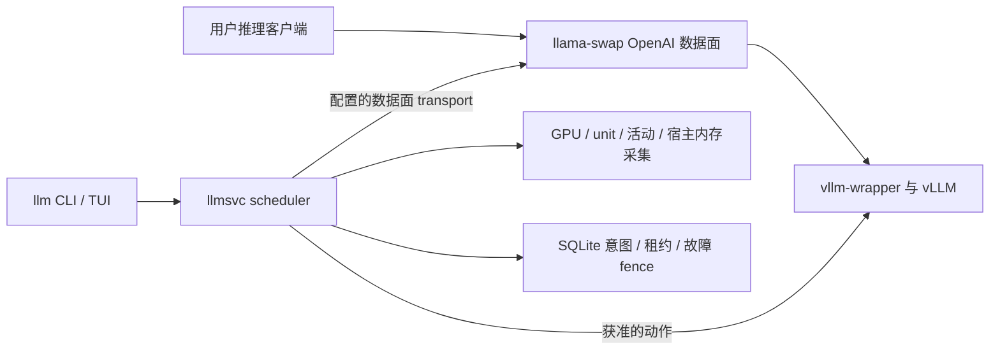

# LLM Service Manager

llama-swap 之上的多 GPU 控制面：查看模型与用量、请求释放/唤醒、设置
pin 与 GPU reserve，并提供可选终端面板。llama-swap 和 vllm-wrapper
负责推理路由、排队及后端 sleep/wake；scheduler 负责资源记账、保护和调度。

当前文档面向 [v0.1.0-alpha.6 发布包](https://github.com/SYandong/LLM-service-manager/releases/tag/v0.1.0-alpha.6)。
发布功能不等于所在部署已启用它们：scheduler 默认只读，模型动作、放置、
自动策略及故障恢复各有独立开关。实现与现场验收进度见 [ROADMAP](docs/ROADMAP.md)。

## 用户：第一次请求

先向部署方取得两个地址及可用模型名；这里的 `.invalid` 地址必须替换，
没有内置服务器地址。只需要请求已有服务的用户无需安装 scheduler 或 vLLM。

| 用途 | 环境变量与地址格式 | 请求去向 |
|---|---|---|
| 模型状态、用量、CLI/TUI 操作 | `LLM_URL=https://scheduler.example.invalid`，不加 `/v1` | scheduler 的 `/v1/state` 等控制 API |
| 模型列表、OpenAI 兼容推理 | `OPENAI_BASE_URL=https://data-plane.example.invalid/v1`，包含 `/v1` | llama-swap 数据面 |

需要 Python 3.10+ 和 curl。以下示例假设部署方已提供可访问的端点；若其网关
需要凭证，请按部署方要求传递，不将凭证写入仓库。scheduler 本身没有鉴权，
管理员应将它限制在受信任网络，不公开暴露。

```sh
export LLM_URL='https://scheduler.example.invalid'
export OPENAI_BASE_URL='https://data-plane.example.invalid/v1'
# 查看数据面当前公布的模型 ID；列表可见不代表模型已驻留或可立即启动。
curl --fail --silent --show-error --max-time 10 "${OPENAI_BASE_URL%/}/models"
export MODEL='replace-with-a-model-id-from-the-list'
```

按数据面返回的 `id` 填写 `MODEL`，不要猜测服务器上的权重目录。
下面发送一条流式请求；`--no-buffer` 及时显示 SSE，输出包含 `data:` 行与
最终的 `[DONE]`。流式输出不能消除冷启动等待，也不保证断线后请求已取消。

```sh
python3 - <<'PYREQUEST' | curl --fail --silent --show-error --no-buffer \
  --max-time 960 "${OPENAI_BASE_URL%/}/chat/completions" \
  --header 'Content-Type: application/json' --data-binary @-
import json
import os
print(json.dumps({
    "model": os.environ["MODEL"],
    "messages": [{"role": "user", "content": "Hello!"}],
    "max_tokens": 64,
    "stream": True,
}))
PYREQUEST
```

`960` 秒只是这个客户端示例的总等待上限，不修改服务端期限或承诺延迟。
已醒模型、sleeping 模型与 stopped 模型的等待不同；冷启动可能需要数分钟。
在启用薄 launcher 的部署中，放置最多等待 120 秒并返回占用/保护阻塞原因，
默认启动窗口为 900 秒；这些不是所有模型的首 token 时延上限。
遇到错误或超时，先检查状态与部署方日志，不循环重发写操作或自行停模型。

## 用户：CLI、状态与可选 TUI

从同一 [发布页](https://github.com/SYandong/LLM-service-manager/releases/tag/v0.1.0-alpha.6)
下载 `llm` 和 `SHA256SUMS`，核对对应 SHA-256 后，将脚本放在当前目录：

```sh
python3 llm --version
python3 llm status
python3 llm status --json
python3 llm usage --days 7 --by model
```

单文件 `llm` 仅需 Python 标准库，不必安装仓库、rich 或 Textual。
源码目录中的等价命令是 `python3 cli/llm status`。`LLM_URL` 使用上面设置的
scheduler 地址；参数/配置优先级及完整命令见 [CLI 使用说明](docs/CLI.md)。

`status` 展示各 GPU 的服务/外部占用、空闲量、模型状态、pin/reserve、租约和
阻塞原因。下列为**合成示例**，不是当前服务器测量：

```text
GPU0  87/144 GiB  llmsvc 77  external 10  free 57
GPU1  ?/? GiB  llmsvc ?  external ?  free ?
RAM   llmsvc 86/200 GiB budget  host available 823 GiB
```

模型行中 `*` 是默认模型，`MEM` 是实际驻留显存，PIN 到期时间用 UTC。
`awake` / `sleeping` / `stopped` 描述已观察的状态；`?`、`unknown` 或 JSON
`null` 表示未知，不是零占用、空闲或已退出。sleeping 仍可能保留 RAM 和完整
租约预算；缺少可信宿主内存源时，RAM 准入不能使用容器 meminfo 或旧快照补零。
源错误、stale 记录及 `blocked_by` 都需要保留并检查。

需要全屏面板时，在独立 Python 环境安装下载的同版 wheel 与可选依赖：

```sh
python3 -m venv .venv
.venv/bin/python -m pip install './llmsvc-0.1.0a6-py3-none-any.whl[tui]'
.venv/bin/llm
```

安装依赖需要可用的软件源或管理员准备的离线 wheelhouse。已安装包的 `llm`
无参数、在 TTY 且 Textual 可用时启动 TUI；否则降级为状态输出。
`r` 刷新、`/` 输入命令、`u` 查看用量、`?` 帮助、`q` 退出。
`f/p/w` 只预填命令，按 Enter 才提交。TUI 事件经 scheduler 转发；缺少数据面
事件不代表无活动，`stopped` 事件也不能单独证明 unit 退出或资源释放。

## 用户：释放、保护、预约与唤醒

先预览，再根据部署方允许的范围决定是否去掉 `--dry-run`；预览不写意图、
不启动/停止模型，也不保证之后实际执行成功。以下 GPU、容量和时长都是示例。

```sh
python3 llm free --gpu 0 --need 80G --dry-run
python3 llm free --ram --need 40G --dry-run
python3 llm pin "$MODEL" --for 1h --dry-run
python3 llm unpin "$MODEL" --dry-run
python3 llm reserve --gpu 0 --size 80G --for 1h --dry-run
python3 llm wake "$MODEL" --dry-run
```

| 命令 | 含义与实际执行前提 | 如何解读回执 |
|---|---|---|
| `free` | 请求额外释放容量；需要非只读与 `model_actions_enabled`。`--ram` 可能停止符合条件的模型，之后需冷启动。 | `complete` 才是完整成功；净变化包括同期外部活动，未知值不以估算替代，也不为调用者保留容量。 |
| `pin` / `unpin` | 保存/解除有期限的 pin；需要非只读与可写状态库。保存不预热，部署还需正确接入 TTL/reaper 保护。 | 检查服务器确认的 owner/到期；普通自动策略尊重 pin，严格证明的故障恢复例外见管理员契约。 |
| `reserve` | 保存 GPU 预约意图；需要非只读与可写库。实际清理还需模型动作开关、可信身份与保护检查。 | 保存成功不等于 evacuation 完成。检查 `complete/blocked/partial`；失败/部分结果仍可能已有预约 ID。有效预约从放置中排除整卡，size 是注记，不保证物理空闲。 |
| `wake` | 等待模型就绪；需要非只读与模型动作。冷启动还依赖已配置的数据面/launcher 及相应放置能力。 | 只有 `ready` 为完整成功；冷启动、部分结果和错误分别展示。 |

HTTP 200 不等于动作成功；阻塞/部分结果返回非零退出码，`--json` 保留完整回执。
free/reserve 默认客户端等待 150 秒，wake 为 930 秒，可用 `--wait` 调整，
不会改变服务端期限。断线后先查 `status`，客户端不会重试写操作。
客户端不切换服务端开关，也不绕过 `read_only` / `operation_not_enabled`。
`unreserve ID [--dry-run]` 通过现有 DELETE API 幂等解除预约，TUI 使用同一命令；
它不唤醒模型，丢失响应时不自动重试。当前发布 CLI 尚无 add/rm 或 reload 命令；
不要据设计草案调用未挂载 API。

## 管理员：架构、部署与回滚



从同版 wheel 安装运行时，从同版源码取得 `deploy/` 工具和示例；使用 Python
3.10+。首先编辑部署路径、模型/unit/探针配置及独立验证端口，在隔离目录预演。
[安装与回滚手册](docs/OPERATIONS.md#staged-installation-8)说明
`install.sh/uninstall.sh/rollback.sh` 的 `--root`、`--settings` 和 `--dry-run`。
安装器不启动服务；其 unit 强制只读。生产 rollback 当前拒绝直接应用到 `/`，
不可把 staging 成功理解为完整生产回滚已执行。

```sh
# 在安装了运行时的环境、同版源码目录中执行；只校验配置，不启动服务。
python3 -m llmsvc --config deploy/scheduler.example.yaml --check-config
```

示例中的 `collectors: {}` 故意产生 unknown；参照
[采集器配置](llmsvc/collectors/README.md)和
[配置后预览前提](docs/OPERATIONS.md#preview-readiness-after-configured-runtime-integration)
提供可信来源，才能评估动作。观察安装/清理见 [observer 手册](deploy/OBSERVER.md)，
离线报告见 [采样摘要](deploy/OBSERVATION.md)；记录实际窗口、样本、缺口与错误，
不把采样覆盖当连续运行证明。

| 管理事项 | 权威入口与边界 |
|---|---|
| 内存预算、固定 idle / GPU 压力阈值 | [自动策略配置](llmsvc/AUTOMATION.md)。默认关闭；实际自动动作需 automation、model actions 和非只读三个开关。候选阈值需来源验证与相应确认，不是通用调优结论。 |
| 并发与冷启动 | [concurrencyLimit 准备](deploy/CONCURRENCY.md)、[薄 launcher](deploy/LAUNCHER.md)。32 客户端实测采用固定 llama-swap 加 fake backend；不是所有 vLLM 模型的容量保证。 |
| TTL/reaper 与生产回滚 | [转换顺序](docs/OPERATIONS.md)及 [DESIGN §7](docs/DESIGN.md#7-部署与验证)。保留完整旧配置/脚本，不并行启用冲突策略；TTL 为零时只停 scheduler 会失去 idle sleep。 |
| 故障恢复与账本 | [FAULTS](llmsvc/FAULTS.md)、[运维恢复限制](docs/OPERATIONS.md#fault-fences-and-ledger-rollback-130)。默认关闭，真实首 claim 才原子迁移 v2→v3；只读/dry-run 不迁移，旧 v2 程序拒绝 v3。 |
| 新模型、LoRA 与 reload | [登记/LoRA 现状](docs/LORA.md)及 [DESIGN](docs/DESIGN.md)。准备服务可见权重、唯一模型名/端口、预算和完整配置候选，交管理员审核；当前不能通过已发布 CLI/HTTP 自助完成登记。 |

启用故障检测前还需验证实际采样约 1 Hz 与严格证据时间界限（含轮次小于
2 秒）；默认 15 秒采样不能证明 10 秒谓词，配置目标不能替代实测。
完整备份须保留账本、pin 和 pending fence，并与当前资源/身份核对后评估回滚。
停用或重启 worker 不会清 fence；未确认的 unload 不能重发、按时间认定完成或
手工删 SQL。单次 HTTP 200 也不能证明清理完成；当前没有强制清除或正向结清
恢复协议。详见上面的运维限制，不用旧备份覆盖活跃记账。

自动 reload 仍受可信连续 quiet（#53）、配置 generation 采用及旧资源结清
（#60）约束；轮询到零或 `/v1/models` 可见不够，不直接改生产配置或发送
SIGHUP。生产策略、TTL/reaper、宿主来源及其他用户服务的变更需要各自授权。

## 验证范围与贡献

本入口命令先前已用 alpha.5 单文件 CLI 和隔离假端点核对模型列表、流式请求、状态/用量
及六条 dry-run 示例；假端点仅返回合成 JSON/SSE，没有运行推理后端。发布包的
配置校验和 TUI 导入也已核对。这不等于真实新成员已在 10 分钟内完成首次推理，
#26 的该项验收仍待实际记录。
长期稳定性与阈值校准 **NOT MEASURED**，没有强制一天/一周日历等待。
发布不自动完成 milestone 或启用生产；开发遵循 [AGENTS.md](AGENTS.md)，
先 issue、再 PR，当前提交须通过独立审核与 CI。

## Legacy：历史维护附录（非新部署入口）

以下保留旧单后端代理的历史安装与行为说明，仅供已存在的 legacy 部署维护。
它不是当前 `llmsvc` 的安装方式；旧依赖/模型示例不代表当前发布支持矩阵。
`vllm_service/`、`tools/dashboard.py`、`config/server.yaml` 及旧测试仍冻结，
直到 #27 的部署及零消费者门槛满足。不要与新控制面并行安装或据此重启共享服务。

<details>
<summary>展开历史 vLLM Service Manager 指南</summary>


A local tool to start and manage a vLLM model server for a group sharing one machine.

### Requirements

- conda environment `vllm` with vLLM 0.19.0 and transformers >= 5.5.0
- `LD_LIBRARY_PATH` set to include the conda env's lib directory (see Setup)

### Setup

```bash
conda create -n vllm python=3.11 -y
conda activate vllm
pip install vllm==0.19.0
pip install "transformers>=5.5.0"

# Fix libstdc++ version mismatch
conda install -c conda-forge libstdcxx-ng -y
mkdir -p $CONDA_PREFIX/etc/conda/activate.d
echo 'export LD_LIBRARY_PATH=$CONDA_PREFIX/lib:$LD_LIBRARY_PATH' > $CONDA_PREFIX/etc/conda/activate.d/env_vars.sh
```

### Configuration

`config/server.yaml` defines the default model and serving parameters:

```yaml
model: "google/gemma-4-31B-it"
host: "0.0.0.0"
port: 8000
backend_port: 8001
gpu_memory_utilization: 0.9
max_model_len: 32768
enable_reasoning: false
reasoning_parser: "deepseek_r1"
```

Supported model IDs:

- `google/gemma-4-31B-it`
- `Qwen/Qwen3-4B-Instruct-2507`

### Usage

```bash
conda activate vllm
cd <project-directory>

python -m vllm_service start
python -m vllm_service stop
python -m vllm_service status
python -m vllm_service restart --model <model-id-or-service-visible-path>
```

`start` starts the proxy as a background service on the user-facing port, loads
the default model, shows the backend vLLM startup output, and returns after the
model is ready. The proxy reads the OpenAI request body's `model` field. If that model is not
currently running, it restarts vLLM on `backend_port`, waits for readiness, and
then forwards the original request. If the request omits `model`, the proxy uses
the default `model` from `config/server.yaml`. `restart --model ...` restarts
the background proxy, overrides that default for the current service run, loads
that model, shows the backend vLLM startup output, and returns after the model
is ready. It does not start raw vLLM on the user-facing port.

The `model` value may be either:

- a Hugging Face model ID, such as `Qwen/Qwen3-4B-Instruct-2507`
- a model path that is readable from the service host, such as a path in shared
  storage mounted on the service host

For fine-tuned local models, use the path as it exists on the service host. Do
not use a path that only exists on the user's laptop or workstation.

### Connecting to the service

For an existing legacy deployment only, obtain its OpenAI-compatible base URL
from its administrator and set `LEGACY_OPENAI_BASE_URL`. Do not use the scheduler URL.

```python
import os
from openai import OpenAI

client = OpenAI(base_url=os.environ["LEGACY_OPENAI_BASE_URL"], api_key="unused")

response = client.chat.completions.create(
    model="Qwen/Qwen3-4B-Instruct-2507",
    messages=[{"role": "user", "content": "Hello!"}],
)
print(response.choices[0].message.content)

# Fine-tuned/local model: replace this with the path visible to the service host.
response = client.chat.completions.create(
    model="<path-visible-to-vllm-service>",
    messages=[{"role": "user", "content": "Hello from my fine-tuned model!"}],
)
print(response.choices[0].message.content)
```

### Logs

Server logs are written to `var/log/vllm.log`.

</details>

<!-- Generated-By: Codex / gpt-6-astra -->
