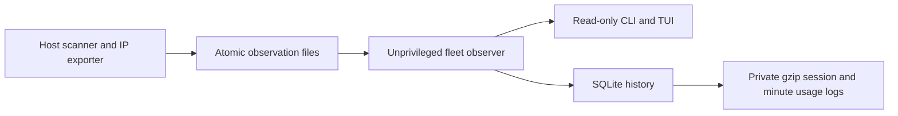

# GPU Fleet Observer

See who is using each GPU, which models are running and how much activity each
service has recorded. Owners run their own inference services. Administrators
use the observations to coordinate capacity.

The host observer replaces the central llmsvc service and the default `llm`
command under #343. Existing scheduler source and deployment tools remain for
historical reference. The current runtime and client use the dedicated fleet
entries described below.

## Use `llm`

```sh
llm                          # Open the GPU terminal view
llm status                   # Show all services
llm fleet --by gpu           # Show allocations on every GPU
llm fleet --by person        # Group services by owner
llm status --show-names      # Reveal owner names
llm status --json            # Read the complete API snapshot
llm history SERVICE_ID --hours 24
```

Names default to stable `User 123456789` labels. Press N in the TUI to reveal
names. GPU segments keep each owner's color; LLMs, Work and unattributed memory
are shown separately. Each model includes its direct API address or `Local only`.
Listeners on `0.0.0.0` are shared by default. A local-only listener stays private
to its network namespace.

Up/Down selects a GPU and keeps it visible. Left/Right selects an allocation
without removing the GPU chart. Wheel and trackpad scroll freely; arrow keys
return to the selected GPU. Z switches between expanded panels and the compact
three-row overview. P opens People; Enter opens details; Q quits. Drag to select
text and use the terminal's copy shortcut.

`Idle` means no activity was observed in the recent window. `Running · inactive`
is the six-hour informational reminder for unshared services. Missing metrics
remain unknown. Coverage is the share of a time interval with usable samples.

See [CLI](docs/CLI.md) for connection settings and commands, and
[Fleet](docs/FLEET.md) for states, counters and API details.

## Install the reader

The copied [fleet reader](cli/fleet-llm) needs Python 3.10 and the standard library.
Set `LLM_URL` to the operator-provided observer base URL:

```sh
export LLM_URL='http://observer.example.invalid:8011'
python3 cli/fleet-llm status
```

For the optional terminal view, install the source with Textual:

```sh
python3 -m venv .venv
.venv/bin/python -m pip install '.[tui]'
.venv/bin/llm
```

The installed `llm` entry loads the fleet reader. The single-file release asset
uses the same source. No-TTY execution prints the snapshot.

## Host observation and archives


```mermaid
flowchart LR
    H[Host scanner and IP exporter] --> E[Atomic observation files]
    E --> O[Unprivileged fleet observer]
    O --> C[Read-only CLI and TUI]
    O --> D[SQLite history]
    D --> A[Private gzip session and minute usage logs]
```

Run `python3 -m llmsvc.fleet.observer --config CONFIG.json`. Configuration and
installation are documented in [FLEET_OBSERVER](docs/FLEET_OBSERVER.md) and
[the host installer](deploy/fleet-observer/README.md).
The observer serves `GET /v1/fleet`, `GET /v1/fleet/history` and `GET /v1/events`.
It constructs no scheduler or model-action controller. Historical claims remain
stored and have no effect on service states.

Usage records contain timestamps, process-session identities and sampled token
increments. They contain no prompts, responses or conversation history. The
archive timer writes private compressed files; lifecycle summaries and checkpoint
state travel with the database during migration.

The migration uses a consistent SQLite backup, preserves every archive and
starts one authoritative observation writer. Both the observer service and
archive timer are enabled. Data-preserving rollback transfers the latest
observations before resuming the previous observation runtime.

## Development

Use Python 3.10. Run `python3 -m pytest -q tests` and the installed entrypoint
smokes. [DESIGN](docs/DESIGN.md) records the current observer architecture;
[ROADMAP](docs/ROADMAP.md) separates delivery and live acceptance. Follow
[AGENTS.md](AGENTS.md) for issue, review and provenance conventions.

<!-- Generated-By: Codex / unknown model -->
